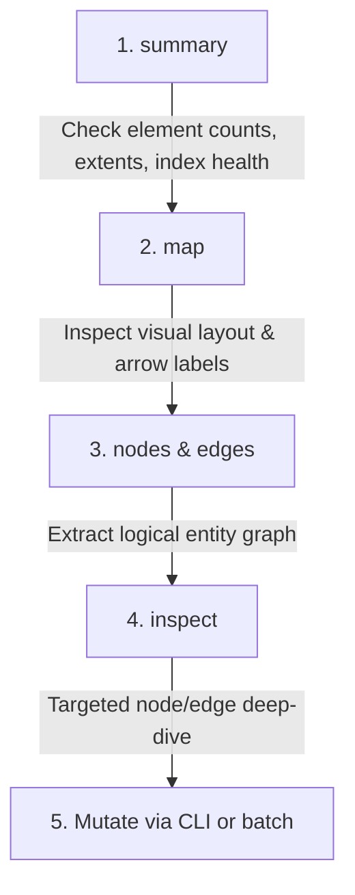
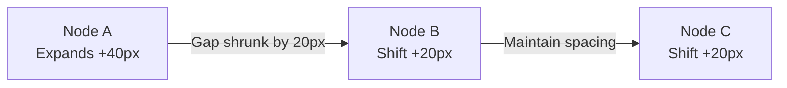
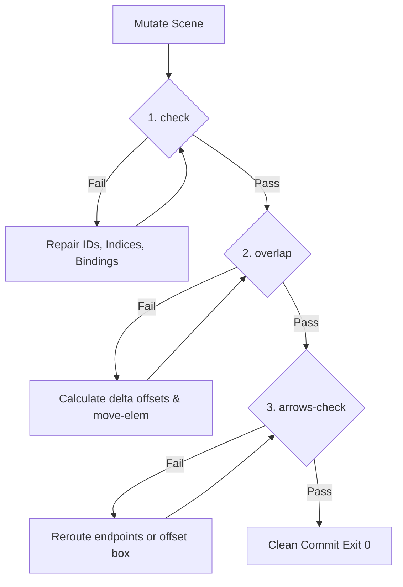

# Excalidraw Agent Guide: Token-Efficient Whiteboard Engineering

**Target Audience**: LLM Coding Agents, Agent Harnesses, and Autonomous Assistants.  
**Canonical Spec**: [`specs/excalidraw-tooling.md`](file:///workspace/specs/excalidraw-tooling.md)  
**Binary Implementation**: [`src/bin/excalidraw_view.rs`](file:///workspace/src/bin/excalidraw_view.rs)  
**Integration Tests**: [`tests/excalidraw_view_test.rs`](file:///workspace/tests/excalidraw_view_test.rs)

---

## 1. The Core Mandate: Why Raw JSON is Forbidden

> [!CAUTION]
> **NEVER read, edit, or write raw `.excalidraw` JSON directly.**  
> Always interact with whiteboard files exclusively through the `excalidraw-view` CLI.

### Why Direct JSON Manipulation Fails

| Problem | Raw JSON Editing | `excalidraw-view` CLI |
| :--- | :--- | :--- |
| **Token Consumption** | **35,000 – 60,000 tokens** per document read/write. | **50 – 250 tokens** via dense projection tables. |
| **Index Ordering** | Fractional base-62 index keys desynchronize with array order, causing Excalidraw frontend crashes. | Monotonic base-62 index minting & auto-sorting on atomic save. |
| **Dual Text Sync** | LLMs edit `text` but omit `originalText` (or vice-versa), causing silent edit erasure on next canvas interaction. | Synchronizes `text` and `originalText` automatically across all edits. |
| **Bidirectional Bindings** | Manual edits break `boundElements` or `containerId` back-references, or leave half-bound arrows. | Maintains bidirectional binding graph integrity and validates 2-bound / 0-bound arrow invariants. |
| **Spatial Layout & Jitter** | LLMs cannot visually anticipate text box dimensions, causing severe element overlap. | Automatic Virgil font metric calculations, padding (`pad_x=40, pad_y=30`), and collision checks. |

---

## 2. Situational Awareness Workflow

When given a task involving an Excalidraw diagram, execute the following token-minimal discovery ladder:



### Step 1: High-Level Orientation (`summary`)
```bash
excalidraw-view diagram.excalidraw summary
```
*Output (~30 tokens)*:
```text
elements: 8  types: {'rectangle': 4, 'arrow': 3, 'text': 1}
extents: x [100, 720]  y [150, 400]
max index: a3
array order == index order: True
```
*What to look for*: Overall canvas bounds, total complexity, max index (needed if importing library items), and health status.

### Step 2: Dense Layout Scan (`map`)
```bash
excalidraw-view diagram.excalidraw map
```
*Output (~80 tokens)*:
```text
r1	rectangle	100,200	140x60	#7a9fbf	Client App
r2	rectangle	320,200	160x60	#8fbc8f	API Gateway
r3	rectangle	560,200	160x60	#c9b458	Auth Service
a1	arrow	r1 -> r2	HTTPS / REST
a2	arrow	r2 -> r3	gRPC / mTLS
t1	text	100,120	Production Ingress Architecture
```
*What to look for*: Element IDs, spatial coordinates $(X,Y)$, dimensions $(W \times H)$, color roles, and arrow topologies with labels.

### Step 3: Logical Node & Edge Filtering (`nodes` / `edges`)
- `nodes`: Prints only structural shapes with labels and semantic roles (folds bound text into the node):
  ```bash
  excalidraw-view diagram.excalidraw nodes
  ```
- `edges` (or `arrows`): Prints only directed arrow connections:
  ```bash
  excalidraw-view diagram.excalidraw edges
  ```

### Step 4: Targeted Inspection (`inspect <id>`)
```bash
excalidraw-view diagram.excalidraw inspect r2
```
*Output (~40 tokens)*:
```text
id: r2
type: rectangle
bounds: 320,200 160x60
label: API Gateway
role: success
inbound: [a1]
outbound: [a2]
```

---

## 3. Reading User Edits with `struct-diff`

When a user modifies a diagram in the Excalidraw UI, standard `git diff` produces hundreds of noisy coordinate diffs. Always run `struct-diff` to extract the pure semantic DSL:

```bash
excalidraw-view diagram.excalidraw struct-diff diagram_edited.excalidraw
```

### Interpreting the Diff DSL

```text
+ node [cache_1] type="rectangle" label="Redis Cache" role="warning"
- node [old_db] type="rectangle" label="MySQL 5.7"
~ node [api_gw] relabeled: "Gateway v1" -> "Envoy Proxy"
~ node [api_gw] role: "info" -> "success"
+ edge [a_cache] api_gw -> cache_1 (label="Cache Get")
- edge [a_old] api_gw -> old_db
~ edge [a_sync] retargeted: s1->s2 -> s1->s3
~ edge [a_sync] relabeled: "HTTP" -> "WebSocket"
```

- **`+ node [id]`**: Node created.
- **`- node [id]`**: Node deleted.
- **`~ node [id] relabeled: ...`**: Node text modified.
- **`~ node [id] role: ...`**: Node visual role / color modified.
- **`+ edge [id] from -> to`**: Connection created.
- **`- edge [id] from -> to`**: Connection deleted.
- **`~ edge [id] retargeted: ...`**: Connection endpoints shifted.
- **`~ edge [id] relabeled: ...`**: Edge label modified.

---

## 4. Granular CRUD Recipes & JSON Batch Templates

### 4.1 CLI Quick Mutations

#### Adding Nodes and Annotations
```bash
# Add a rectangle with centered text and role
excalidraw-view canvas.excalidraw add-node --type rectangle --text "Payment Service" --at 400,200 --role info

# Add free-floating title text
excalidraw-view canvas.excalidraw add-text --text "System Architecture v2" --at 100,50 --font-size 24
```

#### Connecting Nodes
```bash
# Connect two nodes with a labeled arrow
excalidraw-view canvas.excalidraw connect --from node_auth --to node_db --label "Read / Write"
```

#### Updating & Fitting Text
```bash
# Set new text and automatically resize the container around its center point
excalidraw-view canvas.excalidraw fit node_auth "Auth Service (Cluster Active)"
```

#### Moving & Deleting
```bash
# Shift a node and dynamically adjust connected arrows
excalidraw-view canvas.excalidraw move-elem node_db --by 100,0

# Cleanly delete a node and cascade-delete connected arrows
excalidraw-view canvas.excalidraw delete-elem old_node --cascade-arrows
```

---

### 4.2 Copy-Paste JSON Batch Templates

For multi-step modifications, use `batch` with stdin or a `.json` file for atomic execution.

#### Template 1: Linear Microservice Pipeline
```json
[
  { "action": "add-node", "id": "ui", "type": "rectangle", "text": "React Frontend", "at": [100, 200], "size": [160, 60], "role": "info" },
  { "action": "add-node", "id": "gw", "type": "rectangle", "text": "API Gateway", "at": [340, 200], "size": [160, 60], "role": "success" },
  { "action": "add-node", "id": "svc", "type": "rectangle", "text": "Core Service", "at": [580, 200], "size": [160, 60], "role": "emphasis" },
  { "action": "add-node", "id": "db", "type": "rectangle", "text": "PostgreSQL", "at": [820, 200], "size": [160, 60], "role": "warning" },
  { "action": "connect", "from": "ui", "to": "gw", "label": "HTTPS / JSON" },
  { "action": "connect", "from": "gw", "to": "svc", "label": "gRPC / Protobuf" },
  { "action": "connect", "from": "svc", "to": "db", "label": "SQL Pool" },
  { "action": "add-text", "text": "Core Transaction Flow", "at": [100, 120], "fontSize": 24 }
]
```
*Run via*:
```bash
excalidraw-view canvas.excalidraw batch - <<'EOF'
[ ... ]
EOF
```

#### Template 2: Hub-and-Spoke / Fan-Out Cluster
```json
[
  { "action": "add-node", "id": "hub", "type": "rectangle", "text": "Event Broker (Kafka)", "at": [400, 300], "size": [200, 70], "role": "emphasis" },
  { "action": "add-node", "id": "worker1", "type": "rectangle", "text": "Indexer Worker", "at": [150, 150], "size": [150, 50], "role": "info" },
  { "action": "add-node", "id": "worker2", "type": "rectangle", "text": "Notification Worker", "at": [650, 150], "size": [150, 50], "role": "info" },
  { "action": "add-node", "id": "worker3", "type": "rectangle", "text": "Audit Worker", "at": [150, 450], "size": [150, 50], "role": "muted" },
  { "action": "add-node", "id": "worker4", "type": "rectangle", "text": "Billing Worker", "at": [650, 450], "size": [150, 50], "role": "success" },
  { "action": "connect", "from": "hub", "to": "worker1", "label": "topic: events" },
  { "action": "connect", "from": "hub", "to": "worker2", "label": "topic: alerts" },
  { "action": "connect", "from": "hub", "to": "worker3", "label": "topic: audit" },
  { "action": "connect", "from": "hub", "to": "worker4", "label": "topic: charges" }
]
```

---

## 5. The "Fit-then-Shift" Spatial Rule

When you edit the text of a node to a longer string, `set-text` / `fit` performs **symmetrical expansion** around the shape's midpoint:

```
Before fit:  [ x=100, w=120 ] -> center=160
After fit:   [ x=80,  w=160 ] -> center=160  (grows 20px left and 20px right)
```

> [!IMPORTANT]
> Because the box expands equally in both directions, expanding a node reduces the gap to its neighbors on both sides.

### The Downstream Shift Procedure
If expanding a node reduces the horizontal gap to the next node below the minimum padding ($60\text{ px}$), shift downstream nodes by $\Delta X$:



```bash
# 1. Update text on Node A (expands by 60px: 30px left, 30px right)
excalidraw-view canvas.excalidraw fit nodeA "Authentication & Token Issuer Service"

# 2. Shift downstream Node B and Node C to restore 80px gap
excalidraw-view canvas.excalidraw move-elem nodeB --by 30,0
excalidraw-view canvas.excalidraw move-elem nodeC --by 30,0
```

---

## 6. Mathematical Layout Coordinate Formulas

When generating multi-element layouts from scratch, calculate $(X,Y)$ positions using standard geometry:

```
+-------------------------------------------------------------------------+
|                       STANDARD LAYOUT FORMULAS                          |
+-------------------------------------------------------------------------+
| Horizontal Chain:  X_i = X_0 + i * (width + gap_x)                      |
|                    Y_i = Y_0                                            |
|                                                                         |
| Vertical Tree:     Y_level = Y_0 + level * (height + gap_y)             |
|                    X_sibling = X_center + (i - (N-1)/2) * (w + gap_x)   |
|                                                                         |
| Radial Cluster:    X_i = X_center + Radius * cos(2 * pi * i / N)        |
|                    Y_i = Y_center + Radius * sin(2 * pi * i / N)        |
|                                                                         |
| 2D Grid:           X_col = X_0 + col * (width + gap_x)                  |
|                    Y_row = Y_0 + row * (height + gap_y)                 |
+-------------------------------------------------------------------------+
```

### Standard Dimensions & Spacing Constants

| Property | Recommended Default | Safe Minimum |
| :--- | :--- | :--- |
| **Node Width** | `160.0` px | `120.0` px |
| **Node Height** | `60.0` px | `50.0` px |
| **Horizontal Gap (`gap_x`)** | `80.0` – `120.0` px | `50.0` px |
| **Vertical Gap (`gap_y`)** | `80.0` – `100.0` px | `40.0` px |
| **Font Size (Nodes)** | `20.0` pt | `16.0` pt |
| **Font Size (Labels)** | `16.0` pt | `14.0` pt |
| **Font Size (Titles)** | `24.0` – `28.0` pt | `20.0` pt |

---

## 7. Importing & Piping Component Libraries (`.excalidrawlib`)

To reuse pre-built components from an `.excalidrawlib` library file:

### Step 1: Inspect the Library
```bash
excalidraw-view cloud-icons.excalidrawlib lib
```
*Output*:
```text
3 items (format v2, source https://excalidraw.com)
#0	AWS Lambda	2 els	120x60	rectangle+text
#1	PostgreSQL Database	2 els	140x70	rectangle+text
#2	S3 Bucket	3 els	100x80	ellipse+text
```

### Step 2: Get Target Max Index & Extract Item
```bash
# 1. Get max index from target document
MAX_IDX=$(excalidraw-view canvas.excalidraw summary | grep "max index" | awk '{print $3}')

# 2. Extract item #1, minting new unique IDs and indices after $MAX_IDX
excalidraw-view cloud-icons.excalidrawlib item #1 --after "$MAX_IDX" --at 450,200 > /tmp/imported_item.json
```

### Step 3: Append Directly or Batch
The exported JSON array can be merged into the target scene's `elements` array via a temporary file or piped directly.

---

## 8. Self-Healing Validation Loops

Always run the three validation gates after performing diagram mutations:



### Gate 1: Structural Integrity (`check`)
```bash
excalidraw-view canvas.excalidraw check
```
- **Error**: `arrow a1 is half-bound: startBinding=r1, endBinding=none`
  - *Repair*: Connect the other end via `connect` or remove `startBinding` if decorative.
- **Error**: `container r1 lacks boundElements backref to text t1`
  - *Repair*: Re-add `{ "id": "t1", "type": "text" }` to `r1.boundElements` or use `set-text`.

### Gate 2: Element Overlap Auditing (`overlap`)
```bash
excalidraw-view canvas.excalidraw overlap
```
- **Error**: `svc1 (Auth Service) overlaps with svc2 (Database) [200,100 160x60 vs 300,100 160x60]`
  - *Analysis*: Overlap of $60\text{ px}$ horizontally ($200 + 160 = 360 > 300$).
  - *Repair*: Move `svc2` to $X \ge 420$:
    ```bash
    excalidraw-view canvas.excalidraw move-elem svc2 --by 120,0
    ```

### Gate 3: Arrow Occlusion Auditing (`arrows-check`)
```bash
excalidraw-view canvas.excalidraw arrows-check
```
- **Error**: `arrow a1 cuts through box gw (API Gateway)`
  - *Analysis*: Straight-line arrow passes directly across the bounding box of intermediate node `gw`.
  - *Repair*: Shift the intermediate box `gw` vertically out of the direct line of sight:
    ```bash
    excalidraw-view canvas.excalidraw move-elem gw --by 0,100
    ```

---

## 9. Critical Anti-Patterns (Hard Rules for LLMs)

> [!CAUTION]
> Violating any of these rules will cause immediate layout corruption or validation failure.

1. ❌ **NEVER write raw JSON files directly.** Always invoke `excalidraw-view` or `batch`.
2. ❌ **NEVER place nodes with overlapping coordinates.** Always compute $(X, Y)$ using standard box width ($160\text{ px}$) plus gap ($80\text{ px}$).
3. ❌ **NEVER leave half-bound arrows.** If an arrow is connected, both `startBinding` and `endBinding` must be valid nodes.
4. ❌ **NEVER edit text without testing dimensions.** Longer strings expand containers; always run `overlap` after `set-text`/`fit`.
5. ❌ **NEVER delete a shape by manual JSON slicing.** Use `delete-elem <id> --cascade-arrows` to ensure bound texts, containers, and connected arrow bindings are cleaned up cleanly.
6. ❌ **NEVER mix conflicting visual themes.** Use standard role names (`emphasis`, `success`, `info`, `warning`, `error`, `muted`) rather than hardcoding random hex colors.

---

## 10. Quick Reference Cheat Sheet

| Intent | Command / Syntax |
| :--- | :--- |
| **Get Scene Summary** | `excalidraw-view scene.excalidraw summary` |
| **Inspect All Elements** | `excalidraw-view scene.excalidraw map` |
| **Inspect Single Node** | `excalidraw-view scene.excalidraw inspect <id>` |
| **Compare Revisions** | `excalidraw-view old.excalidraw struct-diff new.excalidraw` |
| **Add New Node** | `excalidraw-view scene.excalidraw add-node --type rectangle --text "Name" --at X,Y --role info` |
| **Connect Two Nodes** | `excalidraw-view scene.excalidraw connect --from idA --to idB --label "Label"` |
| **Update Node Text** | `excalidraw-view scene.excalidraw fit <id> "New Long Text"` |
| **Translate Node** | `excalidraw-view scene.excalidraw move-elem <id> --by DX,DY` |
| **Delete Node** | `excalidraw-view scene.excalidraw delete-elem <id> --cascade-arrows` |
| **Execute Transaction** | `excalidraw-view scene.excalidraw batch changes.json` (or `batch -`) |
| **Apply Standard Theme**| `excalidraw-view scene.excalidraw theme apply retro-terminal --all` |
| **Verify Everything** | `excalidraw-view scene.excalidraw check && excalidraw-view scene.excalidraw overlap && excalidraw-view scene.excalidraw arrows-check` |
