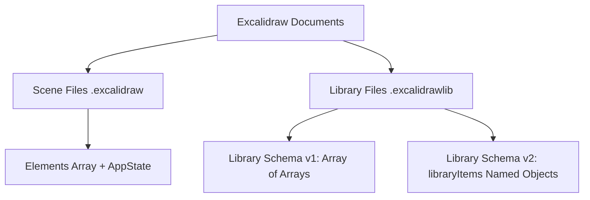
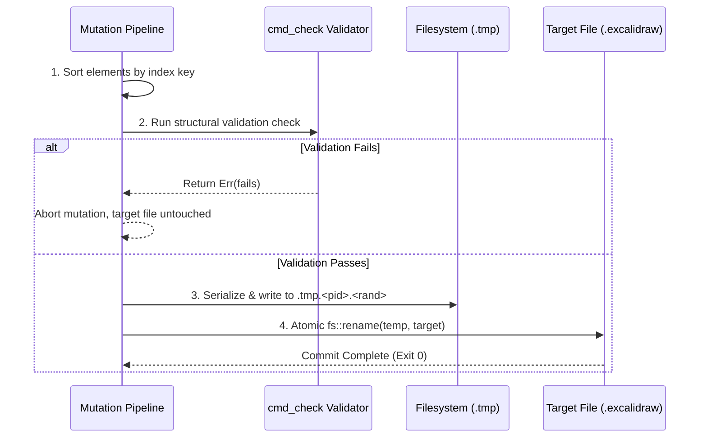

# Excalidraw Tooling Specification (`src/bin/pkb_excalidraw.rs`)

**Status**: Approved Engineering Specification (Single Source of Truth, current-state only).  
**Implementation**: [`src/bin/pkb_excalidraw.rs`](file:///workspace/src/bin/pkb_excalidraw.rs)  
**Integration Tests**: [`tests/pkb_excalidraw_test.rs`](file:///workspace/tests/pkb_excalidraw_test.rs)

---

## 1. Overview & Architectural Purpose

`pkb-excalidraw` is a zero-dependency (stdlib + serde/serde_json/rand) Rust CLI tool engineered to bridge the semantic gap between Large Language Model (LLM) agents and Excalidraw whiteboards (`.excalidraw` and `.excalidrawlib` formats).

Raw Excalidraw JSON documents are intensely token-expensive (typically 20,000–50,000 tokens for moderate diagrams) and rife with fragile mathematical invariants (fractional index ordering, bidirectional container-text bindings, dual-string text wrapping, and geometric arrow coordinate bindings). Manual JSON edits by LLMs routinely introduce catastrophic scene corruption.

`pkb-excalidraw` solves this by providing:
1. **Token-Cheap Projections**: Transforming verbose JSON scenes into dense, line-oriented tabular streams (`summary`, `map`, `nodes`, `edges`) averaging 50–200 tokens.
2. **Semantic Structural Diffing**: Providing node/edge diffs (`struct-diff`) that isolate intentional changes from coordinate floating-point noise.
3. **Atomic, Invariant-Enforcing CRUD**: High-level commands and transactional batch operations (`add-node`, `add-text`, `connect`, `set-text`, `fit`, `move-elem`, `delete-elem`, `batch`) that strictly enforce Excalidraw engine invariants.
4. **Spatial Layout & Aesthetic Automation**: Auto-padding, text measurement, collision detection (`overlap`), arrow intersection auditing (`arrows-check`), and standardized role-based theming (`theme apply`).
5. **Atomic File Safety**: Guaranteeing zero document corruption via dry-run integrity validation and atomic rename (`.tmp.<pid>.<rand>` -> target).

---

## 2. File Formats & Schema Separation

`pkb-excalidraw` handles two distinct file schemas and enforces strict separation between them:



### 2.1 Scene Files (`.excalidraw`)

An `.excalidraw` file represents a full interactive drawing canvas. The top-level structure is a JSON object:

```json
{
  "type": "excalidraw",
  "version": 2,
  "source": "https://excalidraw.com",
  "elements": [ ... ],
  "appState": {
    "viewBackgroundColor": "#ffffff",
    "gridSize": null
  },
  "files": {}
}
```

- **`elements`**: Array of element objects (`rectangle`, `ellipse`, `diamond`, `text`, `arrow`, `line`, `freedraw`, etc.).
- **Live Filtering**: Elements with `"isDeleted": true` are ignored by all projection and validation modes via `live(&doc)`.
- **Z-Index Layering**: The rendering layer order in Excalidraw is strictly governed by the position in the `elements` array, which in turn must strictly correspond to the `index` key.

### 2.2 Library Files (`.excalidrawlib`)

Library files contain reusable component templates. `pkb-excalidraw` transparently supports both historical v1 and current v2 formats:

- **Version 2 Format (Standard)**:
  ```json
  {
    "type": "excalidrawlib",
    "version": 2,
    "source": "https://excalidraw.com",
    "libraryItems": [
      {
        "id": "item-unique-id",
        "status": "published",
        "name": "Database Cluster",
        "elements": [ ... ]
      }
    ]
  }
  ```
- **Version 1 Format (Legacy)**:
  ```json
  {
    "type": "excalidrawlib",
    "version": 1,
    "library": [
      [ { "id": "e1", ... }, { "id": "e2", ... } ]
    ]
  }
  ```

---

## 3. Invariant Laws & Validation Rules

`pkb-excalidraw` codifies and guarantees five core invariant laws. Any mutation that would violate these invariants is rejected before writing to disk.

```
+-------------------------------------------------------------------------+
|                         CORE INVARIANT LAWS                             |
+-------------------------------------------------------------------------+
| 1. Index Ordering  : elements.sort_by(index) == elements array order   |
| 2. Index Alphabet  : Base-62 fractional string keys [0-9A-Za-z]         |
| 3. Dual Text Sync  : split_whitespace(text) == split_whitespace(orig)   |
| 4. Bound Elements  : Container.boundElements <===> Text.containerId    |
| 5. Arrow Topology  : Exactly 2 bindings (start & end) OR 0 (unbound)   |
+-------------------------------------------------------------------------+
```

### 3.1 Strict Ascending `array order == index order`
Excalidraw requires that elements be ordered in ascending lexicographical order of their `index` string attribute. If an element has an index out of sequence or missing, Excalidraw will crash, drop elements, or refuse to open the file.
- **Invariant**: For all $i < j$, `elements[i].index <= elements[j].index`.
- **Validation**: Checked by `cmd_check` and enforced automatically by `atomic_save`.

### 3.2 Base-62 Fractional Index Minting Alphabet
Indices are fractional base-62 keys.
- **Alphabet**: `0123456789ABCDEFGHIJKLMNOPQRSTUVWXYZabcdefghijklmnopqrstuvwxyz` (62 characters).
- **Minting Mechanism (`mint_indices`)**:
  When minting $N$ indices after index `after` (default `"a0"`):
  Each minted index is generated by appending two characters:
  $$c_1 = \text{ALPHABET}[\lfloor i / 62 \rfloor], \quad c_2 = \text{ALPHABET}[i \pmod{62}]$$
  $$\text{Index}_i = \text{after} + c_1 + c_2$$
  This allows minting up to $62 \times 62 = 3844$ consecutive keys in a single operation while maintaining lexicographical monotonicity.

### 3.3 Dual Text Synchronization (`text` vs `originalText`)
Excalidraw text elements contain two text attributes:
1. `text`: The formatted/word-wrapped text rendered on the canvas (contains hard newlines `\n` inserted by the layout engine).
2. `originalText`: The raw prose entered by the author.
- **Invariant**: The whitespace-normalized word sequence of `text` and `originalText` must be strictly identical:
  $$\text{split\_whitespace}(\text{text}) \equiv \text{split\_whitespace}(\text{originalText})$$
- **Failure Mode**: If `text` and `originalText` diverge in content, the Excalidraw editor silently overwrites `text` with `originalText` on the next interaction, erasing edits.

### 3.4 Bidirectional Container-Text Binding
When text is enclosed inside a shape (`rectangle`, `ellipse`, `diamond`) or placed as a label on an `arrow`:
1. The container element must have a back-reference in its `boundElements` array:
   ```json
   "boundElements": [ { "id": "text_id", "type": "text" } ]
   ```
2. The text element must define `containerId`:
   ```json
   "containerId": "container_shape_id"
   ```
3. Text styling properties must be centered: `"textAlign": "center"`, `"verticalAlign": "middle"`.
- **Invariant**: Both pointers must exist simultaneously. Dangling `containerId` or missing `boundElements` backrefs fail validation.

### 3.5 Arrow 2-Bound / 0-Bound Validity Rules
Arrows connect shapes or serve as free-floating visual indicators.
- **Valid States**:
  - **2-Bound (Connected Arrow)**: Both `startBinding` and `endBinding` specify valid, existing element IDs:
    ```json
    "startBinding": { "elementId": "nodeA", "focus": 0.0, "gap": 1.0 },
    "endBinding": { "elementId": "nodeB", "focus": 0.0, "gap": 1.0 }
    ```
    Furthermore, `nodeA` and `nodeB` must include `{"id": "arrow_id", "type": "arrow"}` in their `boundElements`.
  - **0-Bound (Decorative Arrow)**: Both `startBinding` and `endBinding` are `null`.
- **Forbidden State (Half-Bound Arrow)**:
  An arrow where one binding is populated and the other is `null` (e.g. `startBinding=nodeA`, `endBinding=null`) is illegal. Excalidraw frontend corrupts arrow drag handles when half-bound. `cmd_check` explicitly rejects half-bound arrows.

---

## 4. CLI Command Reference & Grammar

`pkb-excalidraw` accepts commands using either standard `pkb-excalidraw FILE COMMAND [args]` or prefix `pkb-excalidraw COMMAND FILE [args]` syntax.

```
Usage:
  pkb-excalidraw FILE [summary|map|nodes|edges|arrows|style|check|overlap|arrows-check]
  pkb-excalidraw FILE inspect <id>
  pkb-excalidraw FILE get <id>
  pkb-excalidraw FILE1 diff FILE2
  pkb-excalidraw FILE1 struct-diff FILE2
  pkb-excalidraw FILE.excalidrawlib lib
  pkb-excalidraw FILE.excalidrawlib item SELECTOR --after INDEX [--at X,Y]
  pkb-excalidraw FILE add-node --type <type> --text "<text>" [--at X,Y] [--size W,H] [--role <role>] [--color <hex>] [--id <custom_id>]
  pkb-excalidraw FILE add-text --text "<text>" --at X,Y [--font-size <size>] [--color <hex>]
  pkb-excalidraw FILE connect --from <id1> --to <id2> [--label "<label>"] [--color <hex>]
  pkb-excalidraw FILE set-text <id> "<new_text>"
  pkb-excalidraw FILE fit <id> "<new_text>"
  pkb-excalidraw FILE move-elem <id> [--to X,Y | --by DX,DY]
  pkb-excalidraw FILE delete-elem <id> [--cascade-arrows]
  pkb-excalidraw FILE batch <changes.json | - >
  pkb-excalidraw FILE theme export [out.json]
  pkb-excalidraw FILE theme apply <theme.json | default | retro-terminal | aops-default> [--all | --id <id>]
```

### 4.1 Projection & Inspection Modes

| Command | Purpose | Output Format / Example |
| :--- | :--- | :--- |
| `summary` | Canvas overview, element counts, bounding box extents, index health. | `elements: 12  types: {'rectangle': 6, 'arrow': 4, 'text': 2}`<br>`extents: x [100, 850]  y [150, 600]`<br>`max index: a5`<br>`array order == index order: True` |
| `map` | Dense TSV map of all visual shapes, arrows, and standalone text. | `r1\trectangle\t100,150\t180x60\t#8fbc8f\tAPI Gateway`<br>`a1\tarrow\tr1 -> r2\tHTTPS / JSON`<br>`t1\ttext\t100,80\tSystem Architecture` |
| `nodes` | Filtered list of logical shapes and container nodes (folds text into node). | `r1\trectangle\t100,150\t180x60\tsuccess\tAPI Gateway` |
| `edges` / `arrows` | Filtered list of directed arrow connections and their labels. | `a1\tr1 -> r2\tHTTPS / JSON` |
| `inspect <id>` | Full structural inspection of an element, including inbound/outbound arrows. | `id: r1`<br>`type: rectangle`<br>`bounds: 100,150 180x60`<br>`label: API Gateway`<br>`role: success`<br>`inbound: []`<br>`outbound: [a1]` |
| `get <id>` | Pretty-printed raw JSON of a single element by ID. | Formatted JSON object. |
| `style` | Statistical distribution of visual properties (roughness, fonts, colors, roundness). | `fillStyle: modal=hachure  all={'hachure': 8, 'solid': 2}`<br>`fontFamily: modal=1  all={1: 10}` |

### 4.2 Structural Diffing Modes

#### `diff FILE1 FILE2`
Provides high-level metric changes, histogram deltas, disappeared elements, added elements, attribute modifications (position shifts, size changes, background colors), and topology updates.

#### `struct-diff FILE1 FILE2`
Computes a pure semantic diff of the logical graph, completely filtering out coordinate floating-point noise and raw element bindings:
```
+ node [db1] type="rectangle" label="PostgreSQL Primary" role="emphasis"
- node [cache_old] type="rectangle" label="Memcached"
~ node [auth_svc] relabeled: "Auth v1" -> "Auth v2 (OIDC)"
~ node [auth_svc] role: "warning" -> "success"
+ edge [a_new] auth_svc -> db1 (label="Pool Conn")
- edge [a_old] auth_svc -> cache_old
~ edge [a_sync] retargeted: db1->db2 -> db1->db3
~ edge [a_sync] relabeled: "Async Repl" -> "Semi-Sync Repl"
```

### 4.3 Library Management Modes

- **`lib`**: Lists all components in an `.excalidrawlib` file:
  ```
  3 items  (format v2, source https://excalidraw.com)
  #0	Database Node	2 els	140x60	rectangle+text
  #1	Microservice Container	2 els	200x80	rectangle+text
  #2	Kafka Cluster	5 els	320x160	rectangle+text+ellipse
  ```
- **`item <selector> --after <index> [--at X,Y]`**:
  Extracts an item by index (`#0`) or name substring (`"Database"`). Automatically re-keys all internal element IDs and `groupIds`, remints new fractional indices monotonically after `--after`, translates coordinates to `--at X,Y`, and outputs a ready-to-insert JSON array.

### 4.4 Granular CRUD Commands

- **`add-node`**:
  `pkb-excalidraw FILE add-node --type rectangle --text "Worker Node" --at 200,300 --size 160,60 --role info`
  - Generates container shape + bound centered text element.
  - Automatically calculates dimensions if `--size` is omitted.
  - Applies role theme colors if `--role` is specified.
- **`add-text`**:
  `pkb-excalidraw FILE add-text --text "System Architecture v2" --at 100,50 --font-size 24 --color "#333333"`
- **`connect`**:
  `pkb-excalidraw FILE connect --from nodeA --to nodeB --label "gRPC Call" --color "#404040"`
  - Computes center-to-center arrow endpoints.
  - Creates arrow element and updates `boundElements` on both connected nodes.
  - Generates container-bound centered text label if `--label` is provided.
- **`set-text` / `fit`**:
  `pkb-excalidraw FILE set-text nodeA "Worker Node (Replicas: 3)"`
  - Updates both `text` and `originalText`.
  - Recalculates text dimensions.
  - Automatically expands the parent container if text exceeds boundaries while preserving the exact center point (symmetrical expansion).
  - Re-centers arrow labels if target is an arrow.
- **`move-elem`**:
  `pkb-excalidraw FILE move-elem nodeA --by 50,100` (or `--to 400,200`)
  - Translates container shape and bound text synchronously.
  - Dynamically shifts endpoints of connected arrows (`startBinding` or `endBinding`).
  - Translates arrow labels proportionally ($\Delta/2$ for single-end moves, $\Delta$ for dual-end moves).
- **`delete-elem`**:
  `pkb-excalidraw FILE delete-elem nodeA [--cascade-arrows]`
  - Recursively removes container shape and bound text.
  - If `--cascade-arrows` is passed, deletes all connected arrows and their labels.
  - If `--cascade-arrows` is omitted, cleanly unbinds connected arrows (sets bindings to `null`) and strips references from surviving nodes, maintaining the 0-bound invariant.

---

## 5. Formal JSON Schema for Batch Payloads

The `batch` command executes an atomic sequence of mutations from a JSON array (via file path or stdin `-`). If any mutation fails, no changes are committed.

### 5.1 JSON Schema Definition

```json
{
  "$schema": "http://json-schema.org/draft-07/schema#",
  "title": "ExcalidrawViewBatchPayload",
  "type": "array",
  "items": {
    "oneOf": [
      {
        "type": "object",
        "properties": {
          "action": { "type": "string", "enum": ["add-node", "add_node"] },
          "type": { "type": "string", "enum": ["rectangle", "ellipse", "diamond"], "default": "rectangle" },
          "text": { "type": "string" },
          "at": { "type": "array", "items": { "type": "number" }, "minItems": 2, "maxItems": 2 },
          "size": { "type": "array", "items": { "type": "number" }, "minItems": 2, "maxItems": 2 },
          "role": { "type": "string", "enum": ["emphasis", "success", "info", "warning", "error", "surface", "muted"] },
          "color": { "type": "string" },
          "id": { "type": "string" }
        },
        "required": ["action", "text"]
      },
      {
        "type": "object",
        "properties": {
          "action": { "type": "string", "enum": ["add-text", "add_text"] },
          "text": { "type": "string" },
          "at": { "type": "array", "items": { "type": "number" }, "minItems": 2, "maxItems": 2 },
          "fontSize": { "type": "number", "default": 20.0 },
          "color": { "type": "string" }
        },
        "required": ["action", "text", "at"]
      },
      {
        "type": "object",
        "properties": {
          "action": { "type": "string", "enum": ["connect"] },
          "from": { "type": "string" },
          "to": { "type": "string" },
          "label": { "type": "string" },
          "color": { "type": "string" }
        },
        "required": ["action", "from", "to"]
      },
      {
        "type": "object",
        "properties": {
          "action": { "type": "string", "enum": ["set-text", "set_text", "fit"] },
          "id": { "type": "string" },
          "text": { "type": "string" }
        },
        "required": ["action", "id", "text"]
      },
      {
        "type": "object",
        "properties": {
          "action": { "type": "string", "enum": ["move", "move-elem", "move_elem"] },
          "id": { "type": "string" },
          "to": { "type": "array", "items": { "type": "number" }, "minItems": 2, "maxItems": 2 },
          "by": { "type": "array", "items": { "type": "number" }, "minItems": 2, "maxItems": 2 }
        },
        "required": ["action", "id"]
      },
      {
        "type": "object",
        "properties": {
          "action": { "type": "string", "enum": ["delete", "delete-elem", "delete_elem"] },
          "id": { "type": "string" },
          "cascade_arrows": { "type": "boolean", "default": false }
        },
        "required": ["action", "id"]
      },
      {
        "type": "object",
        "properties": {
          "action": { "type": "string", "enum": ["theme-apply", "apply-theme", "apply_theme"] }
        },
        "required": ["action"]
      }
    ]
  }
}
```

### 5.2 Example Transaction Payload

```json
[
  { "action": "add-node", "id": "svc_auth", "type": "rectangle", "text": "Auth Service", "at": [100, 100], "role": "info" },
  { "action": "add-node", "id": "db_auth", "type": "rectangle", "text": "Auth DB (Postgres)", "at": [350, 100], "role": "emphasis" },
  { "action": "connect", "from": "svc_auth", "to": "db_auth", "label": "SQL / TLS" },
  { "action": "add-text", "text": "Identity Boundary", "at": [100, 50], "fontSize": 20 }
]
```

---

## 6. Layout Mathematics & Geometry Algorithms

`pkb-excalidraw` embeds precise layout and collision mathematics to ensure clean, human-quality visual output.

### 6.1 Font Metrics & Dimension Calculation

For Excalidraw's default Virgil handwritten font (`fontFamily: 1`):
- **Character Width**: Approximately $0.56 \times \text{fontSize}$.
- **Line Height**: $1.25 \times \text{fontSize}$.
- **Formula (`compute_text_dimensions`)**:
  Given $L$ lines with maximum character count $M$:
  $$\text{Text Width } (tw) = \max(M \times \text{fontSize} \times 0.56, 20.0)$$
  $$\text{Text Height } (th) = \max(L \times (\text{fontSize} \times 1.25), \text{fontSize} \times 1.25)$$

### 6.2 Container Box Padding & Centering

When placing text inside a shape:
- **Default Box Padding**: $\text{pad}_x = 40.0$, $\text{pad}_y = 30.0$.
- **Box Dimensions**:
  $$\text{Box Width } (bw) = \max(tw + \text{pad}_x, 100.0)$$
  $$\text{Box Height } (bh) = \max(th + \text{pad}_y, 50.0)$$
- **Text Centering Coordinates**:
  $$tx = x + \frac{bw - tw}{2.0}, \quad ty = y + \frac{bh - th}{2.0}$$

### 6.3 Symmetrical Center Expansion ("Fit-then-Shift")

When updating text on an existing node via `set-text` or `fit`, the container box must resize to fit longer text without shifting its visual center of mass:

```
  +--------------------+             +----------------------------+
  |                    |             |                            |
  |     Old Text       |   =====>    |       New Long Text        |
  |                    |             |                            |
  +--------------------+             +----------------------------+
      (old_center)                               (old_center)
```

$$\text{old\_mid}_x = cx + \frac{cw}{2.0}, \quad \text{old\_mid}_y = cy + \frac{ch}{2.0}$$
$$\text{new\_cw} = \max(cw, tw + \text{pad}_x), \quad \text{new\_ch} = \max(ch, th + \text{pad}_y)$$
$$\text{new\_cx} = \text{old\_mid}_x - \frac{\text{new\_cw}}{2.0}, \quad \text{new\_cy} = \text{old\_mid}_y - \frac{\text{new\_ch}}{2.0}$$
$$\text{new\_tx} = \text{new\_cx} + \frac{\text{new\_cw} - tw}{2.0}, \quad \text{new\_ty} = \text{new\_cy} + \frac{\text{new\_ch} - th}{2.0}$$

### 6.4 Arrow Geometry & Midpoint Label Routing

For straight arrows connecting `nodeA` $(x_1, y_1, w_1, h_1)$ to `nodeB` $(x_2, y_2, w_2, h_2)$:
1. Centers: $C_1 = (x_1 + w_1/2, y_1 + h_1/2)$, $C_2 = (x_2 + w_2/2, y_2 + h_2/2)$.
2. Delta: $dx = C_{2x} - C_{1x}$, $dy = C_{2y} - C_{1y}$.
3. Arrow root: $x = C_{1x}, y = C_{1y}$, `points` = `[[0.0, 0.0], [dx, dy]]`.
4. Arrow Midpoint:
   $$M = \left( x + \frac{dx}{2}, \, y + \frac{dy}{2} \right)$$
5. Label Placement: Centered on $M$:
   $$lx = M_x - \frac{ltw}{2.0}, \quad ly = M_y - \frac{lth}{2.0}$$

### 6.5 Axis-Aligned Bounding Box (AABB) Overlap (`overlap`)

Two rectangles $R_1(x_1, y_1, w_1, h_1)$ and $R_2(x_2, y_2, w_2, h_2)$ overlap if and only if:
$$(x_1 < x_2 + w_2) \land (x_1 + w_1 > x_2) \land (y_1 < y_2 + h_2) \land (y_1 + h_1 > y_2)$$
- **Nested Enclosure Filter**: If $R_1$ completely encloses $R_2$ or vice versa, the collision is ignored (allowing semantic group containers).

### 6.6 2D Segment-Rectangle Intersection (`arrows-check`)

Arrows must not intersect unrelated intermediate boxes. The segment-rectangle intersection algorithm performs:
1. **Cross-Product Counter-Clockwise (CCW) Primitive**:
   $$\text{ccw}(A, B, C) = (B_x - A_x)(C_y - A_y) - (B_y - A_y)(C_x - A_x)$$
2. **Segment Intersection**: Two segments $P_1P_2$ and $P_3P_4$ intersect if and only if:
   $$(\text{ccw}(P_3, P_4, P_1) \times \text{ccw}(P_3, P_4, P_2) < 0) \land (\text{ccw}(P_1, P_2, P_3) \times \text{ccw}(P_1, P_2, P_4) < 0)$$
3. **Box Intersection**: Tests arrow segment $P_1P_2$ against the 4 boundary edges of the box, plus tests if the segment midpoint lies inside the box.
4. **Boundary Margin**: A 1.0 px inward margin is applied to avoid false alarms on boundary grazing.
5. **Background Zone Filter**: Boxes that enclose $\ge 3$ other shapes are recognized as background grouping zones and excluded from collision checks.

---

## 7. Theme Schema & Built-in Palette

The theme engine standardizes fonts, roughness, fill styles, and semantic color roles.

### 7.1 Theme Structure

```rust
pub struct Theme {
    pub name: String,
    pub font_family: i64,      // 1: Virgil, 2: Helvetica, 3: Cascadia
    pub roughness: i64,        // 0: Architect, 1: Artist, 2: Cartoonist
    pub fill_style: String,    // "hachure", "cross-hatch", "solid"
    pub stroke_color: String,
    pub text_color: String,
    pub roles: HashMap<String, String>,
}
```

### 7.2 The `retro-terminal` / `aops-default` Palette

| Role | Color Hex | Visual Swatch Description | Semantic Usage |
| :--- | :--- | :--- | :--- |
| `emphasis` | `#c9b458` | Vintage Muted Yellow / Gold | Primary focal points, active state, core databases |
| `success` | `#8fbc8f` | Sage / Dark Sea Green | Completed steps, healthy services, successful checks |
| `info` | `#7a9fbf` | Steel / Muted Slate Blue | Gateways, intermediate microservices, standard APIs |
| `warning` | `#ffa500` | Warm Amber / Orange | Fallback paths, rate-limiters, queues under load |
| `error` | `#ff6666` | Soft Coral / Light Red | Dead letter queues, circuit breakers, failure paths |
| `surface` | `#252525` | Dark Charcoal | Boundary backdrops, container groups |
| `muted` | `#888888` | Medium Neutral Gray | Deprecated components, secondary annotations |

Default properties: `font_family: 1` (Virgil), `roughness: 2`, `fill_style: "hachure"`, `stroke_color: "#404040"`, `text_color: "#1a1a1a"`.

---

## 8. Atomic I/O Contracts & Exit Codes

### 8.1 Atomic Save Contract (`atomic_save`)

Every mutating operation follows a strict 4-step atomic write pipeline:



1. **Index Sort**: Sorts the in-memory `elements` array so array order strictly equals index order.
2. **Integrity Validation (`cmd_check`)**: Verifies duplicate IDs, index monotonicity, text sync, and arrow topology. If validation fails, execution halts and the target file is untouched.
3. **Temporary Write**: Serializes pretty-printed JSON to `.tmp.<pid>.<rand>` located in the same parent directory as the target file (guaranteeing identical filesystem mount).
4. **Atomic Rename**: Atomically swaps `.tmp.<pid>.<rand>` over the target file using `fs::rename`. Cleans up the temporary file on error.

### 8.2 Process Exit Codes

| Exit Code | Meaning | Triggers |
| :---: | :--- | :--- |
| `0` | **Success** | Command succeeded, checks passed, or validation clean. |
| `1` | **Error / Validation Failure** | Missing arguments, parse errors, duplicate IDs, half-bound arrows, collisions detected by `overlap` or `arrows-check`, or I/O failure. |

---

## 9. Implementation File References

- Binary Source: [`src/bin/pkb_excalidraw.rs`](file:///workspace/src/bin/pkb_excalidraw.rs)
- Test Suite: [`tests/pkb_excalidraw_test.rs`](file:///workspace/tests/pkb_excalidraw_test.rs)
