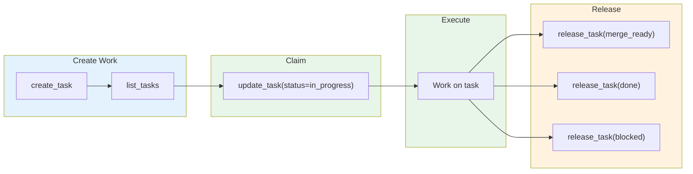

# Work Management: Tasks MCP

## Giving Effect

- PKB MCP server (Rust, `nicsuzor/mem`) implementing task CRUD and graph operations
- [[mcp__pkb__create_task]] - Create task
- [[mcp__pkb__update_task]] - Update task fields (priority, tags, assignee, body)
- [[mcp__pkb__release_task]] - Release task to handoff status with required summary
- [[mcp__pkb__complete_task]] - Mark task done with completion evidence
- [[mcp__pkb__list_tasks]] - List tasks with filters
- [[commands/pull.md]] - `/pull` command for claiming and executing tasks
- [[commands/dump.md]] - `/dump` command for session handover

Tasks MCP is the primary work management system for multi-session tracking, dependencies, and strategic work.



**When to use Tasks MCP**:

- Multi-session work (spans multiple conversations)
- Work with dependencies (blocked by / blocks)
- Strategic planning and tracking
- Discoverable by future sessions

## Core Functions

| Function                                           | Purpose                                                     |
| -------------------------------------------------- | ----------------------------------------------------------- |
| `mcp__pkb__create_task(title, ...)`                | Create new task                                             |
| `mcp__pkb__get_task(id)`                           | Get task details + relationship context                     |
| `mcp__pkb__update_task(id, updates={...})`         | Update non-terminal fields (priority, tags, assignee, body) |
| `mcp__pkb__release_task(id, status, summary, ...)` | Release task to handoff status with summary                 |
| `mcp__pkb__complete_task(id, completion_evidence)` | Mark task done with evidence (legacy path)                  |
| `mcp__pkb__list_tasks(status, ...)`                | List/filter tasks                                           |
| `mcp__pkb__task_search(query)`                     | Semantic search across tasks                                |
| `mcp__pkb__decompose_task(parent_id, subtasks)`    | Break down task into subtasks                               |

## User Expectations

- **State Transparency**: Users can always see the exact, real-time status of all work. Canonical statuses are defined in [[aops-core/skills/remember/references/TAXONOMY.md#status-values-and-transitions]].
- **Justification (The "Why")**: Every task must be anchored in the hierarchy (Goal → Project → Epic → Task). Users can always trace why a task exists by examining its parent field.
- **Actionable Visibility**: Users can query for actionable work and receive a prioritized list of unblocked leaf tasks that are ready for execution.
- **Multi-Session Continuity**: Work state is persisted in markdown files, allowing work started in one session to be safely paused and accurately resumed in another by any agent.
- **Ownership Clarity**: Every task has an explicit `assignee` (`nic` for human, `bot` for agent), ensuring no ambiguity about who is responsible for the next step.
- **Dependency Awareness**: The system explicitly tracks blocking relationships. When a task is stalled, the user can identify exactly which dependency or human input is required to proceed.
- **Fail-Fast Diagnostics**: When an execution fails, the task must record a `diagnostic` message. Users expect to understand the reason for failure without manual log analysis.
- **Searchability & Indexing**: All tasks are indexed and searchable by title, tag, or project, ensuring that every work item remains discoverable and no context is lost over time.

## Task Lifecycle

### State Machine

```
inbox → ready → queued → in_progress → merge_ready (PR filed) → done (after merge)
                                     → done (non-code task completed)
                                     → review (needs human attention)
                                     → blocked (external dependency)
                                     → cancelled (abandoned)
```

See [[aops-core/skills/remember/references/TAXONOMY.md#status-values-and-transitions]] for canonical status definitions.

**`inbox → ready` graduation** requires the task to have:

1. Concrete acceptance criteria (non-empty body with AC or checklist)
2. Explicit effort estimate OR explicit `complexity` field
3. No high-uncertainty blockers (blockers must be explicit `depends_on` links, not vague body text)
4. Either leaf (no children) OR decomposed into subtasks where all children are beyond `inbox`

Tasks created via `create_task` default to `inbox`. They graduate to `ready` automatically once decomposition and dependency resolution are complete. The human then manually promotes `ready → queued` to make them available for agent dispatch.

This gate exists to prevent agents from picking up half-baked tasks before they have been properly planned. See [[specs/orchestrator-boundary.md]] for context.

### Claiming Tasks

Use `update_task` to claim:

```
update_task(id="<task-id>", status="in_progress", assignee="polecat")
```

### Releasing Tasks

Use `release_task` for all terminal/handoff transitions. Flat parameters — no nested objects:

```
release_task(id, status, summary, pr_url?, branch?, blocker?, reason?)
```

| Target Status | summary  | pr_url    | blocker   | reason    |
| ------------- | -------- | --------- | --------- | --------- |
| `merge_ready` | REQUIRED | soft-warn | -         | -         |
| `done`        | REQUIRED | optional  | -         | -         |
| `blocked`     | REQUIRED | -         | soft-warn | -         |
| `cancelled`   | REQUIRED | -         | -         | soft-warn |

`release_task` appends a timestamped evidence block to the task body, sets `released_at` in frontmatter, and records `pr_url`/`branch` if provided.

**Hard errors**: missing summary, unknown status, task already terminal (done/cancelled).

**Soft warnings**: context-specific fields missing (logged in response, tool still succeeds).

### Why `release_task` Instead of `update_task`

`update_task` historically required a nested `updates={...}` JSON object, which agents frequently serialized as a string instead of an object, dropped fields on retry, or forgot entirely. While it now supports flat parameters for convenience, `release_task` remains preferred for terminal transitions because it uses flat string parameters and always requires a summary, making it harder to lose information than to capture it.

`update_task` remains for non-terminal field changes (priority, tags, assignee, body). It soft-hints toward `release_task` when a terminal status is detected.

### Statuses

Statuses are canonical — see [[aops-core/skills/remember/references/TAXONOMY.md#status-values-and-transitions]]. The work-management subsystem uses the canonical set without extensions.

**Default on create**: `inbox`. Tasks graduate to `ready` once decomposition and dependency resolution are complete. The human manually promotes `ready → queued` to make tasks available for agent dispatch. Agents pull only from `queued`.

## Multi-Project Organization

Tasks are organized by `project` field:

| Project   | Use For               |
| --------- | --------------------- |
| `aops`    | Framework tasks       |
| `writing` | Writing project tasks |
| (custom)  | Other projects        |

**Create with project**:

```python
mcp__pkb__create_task(
    title="Task title",
    type="task",
    project="aops",
    priority=2
)
```

## Dependencies

Tasks can depend on other tasks:

```python
# Create dependent task
mcp__pkb__create_task(
    title="Implement feature",
    depends_on=["task-id-of-prerequisite"]
)

# Check what's blocked
mcp__pkb__get_blocked_tasks()
```

## Graph Insertion Responsibility

**The creating agent is responsible for inserting tasks onto the work graph.**

Every task must be connected to the hierarchy:

```
task → epic → chain → project → strategic priority
```

When creating a task, the agent MUST:

1. **Identify the parent epic** - Search for existing epics in the project
2. **Link the task** - Use `depends_on` or wikilinks to connect to parent
3. **Create intermediates if needed** - If no suitable epic exists, create one that links to a project

**Why this matters:**

- Disconnected tasks become invisible to prioritization
- Orphaned work cannot be sequenced for delivery
- The task graph visualization reveals structural gaps

**Anti-pattern:** Creating standalone tasks without graph connections. If a task has no parent, it's not properly inserted.

```python
# WRONG: Orphaned task
mcp__pkb__create_task(
    title="Fix login bug",
    project="webapp"
)

# RIGHT: Connected to parent epic
mcp__pkb__create_task(
    title="Fix login bug",
    project="webapp",
    depends_on=["webapp-auth-epic"]  # Links to parent
)
```

## Body Content Coherence

Task bodies should contain context, acceptance criteria, and rationale — not checklists that duplicate the subtask graph.

**Anti-pattern: Parallel tracking**

When a task body contains `- [ ]` checklist items AND has subtasks tracking the same work, the two inevitably diverge. Completed subtasks don't update the body checklist, creating false "no progress" signals.

**Rules:**

1. Don't put `- [ ]` checklists in task bodies if the items will be tracked as subtasks
2. When decomposing a task, replace any source checklist with a reference to children (e.g., "Decomposed into N subtasks — see children")
3. The `body` parameter in `create_task` is for markdown body content, not frontmatter — don't pass `body` as a frontmatter key
4. The subtask graph is the single source of truth for progress tracking

## Task Assignment

Tasks can be assigned to a specific actor:

| Assignee | Meaning                                           |
| -------- | ------------------------------------------------- |
| `nic`    | Human tasks - requires judgment, external context |
| `bot`    | Agent tasks - automatable work                    |
| (unset)  | Available to anyone (legacy compatibility)        |

**Creating assigned tasks**:

```python
mcp__pkb__create_task(
    title="Review proposal",
    assignee="nic"  # Human task
)
```

**Listing tasks by assignee**:

```python
# Bot tasks
mcp__pkb__list_tasks(project="aops", assignee="bot")

# Human tasks
mcp__pkb__list_tasks(project="aops", assignee="nic")
```

## Task Storage

Tasks are stored as markdown files in `data/tasks/`:

- `data/tasks/inbox/` - New tasks
- `data/tasks/index.json` - Task index for fast queries
